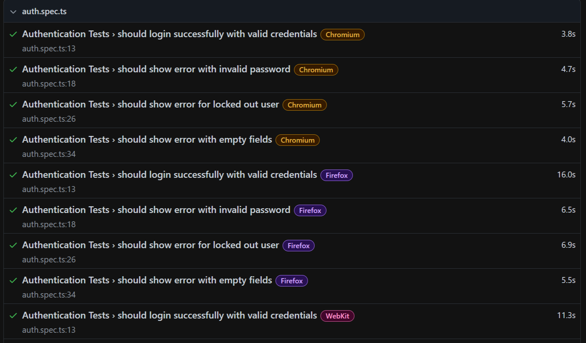
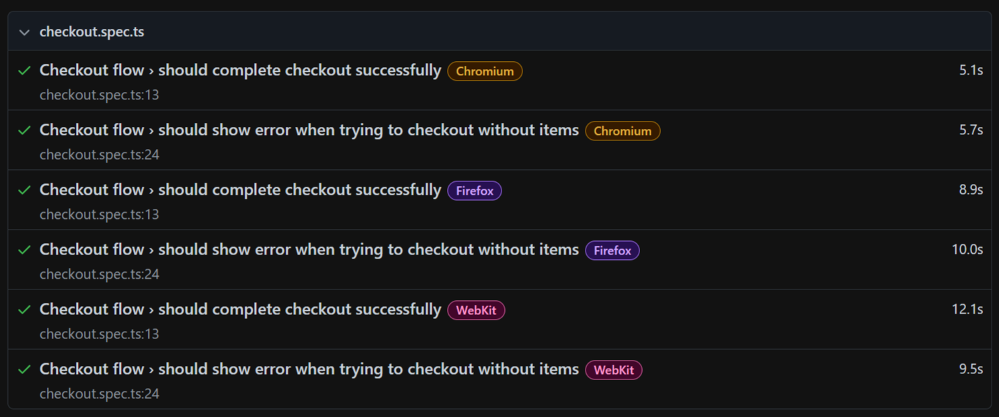

# Playwright Automation Portfolio

## HTML Test Report




## Project Overview
UI automation framework built with Playwright and TypeScript.  
This project demonstrates real-world QA automation practices using Page Object Model (POM) and includes both UI and API tests.

## Tech Stack
- Playwright
- TypeScript
- Node.js
- Page Object Model (POM)
- GitHub Actions (CI/CD)
- HTML Reports

## Test Scope

### UI Tests
- Authentication (positive & negative scenarios)
- Cart and checkout flow
- Negative checkout scenarios

### API Tests
- Public API validations
- Schema and response checks

## Framework Design
- Page Object Model (POM)
- Data-driven testing
- Reusable utilities
- Screenshots, videos & traces on test failure

## Testing Strategy
Key decisions:
- POM separates test logic from UI selectors for maintainability
- Authentication stored via `storageState` to reduce flakiness
- Cross-browser tests run in CI (Chromium, Firefox, WebKit)
- API tests demonstrate backend validation patterns
- Automated reports (HTML) for every test run

## How to Run Tests

### 1. Install dependencies
```bash
npm install

2. Run all tests
npx playwright test

3. Run specific test file
npx playwright test tests/auth.spec.ts

4. Run tests in headed mode
npx playwright test --headed

5. Run tests in a specific browser
npx playwright test --project=firefox

6. Show HTML report
npx playwright show-report
